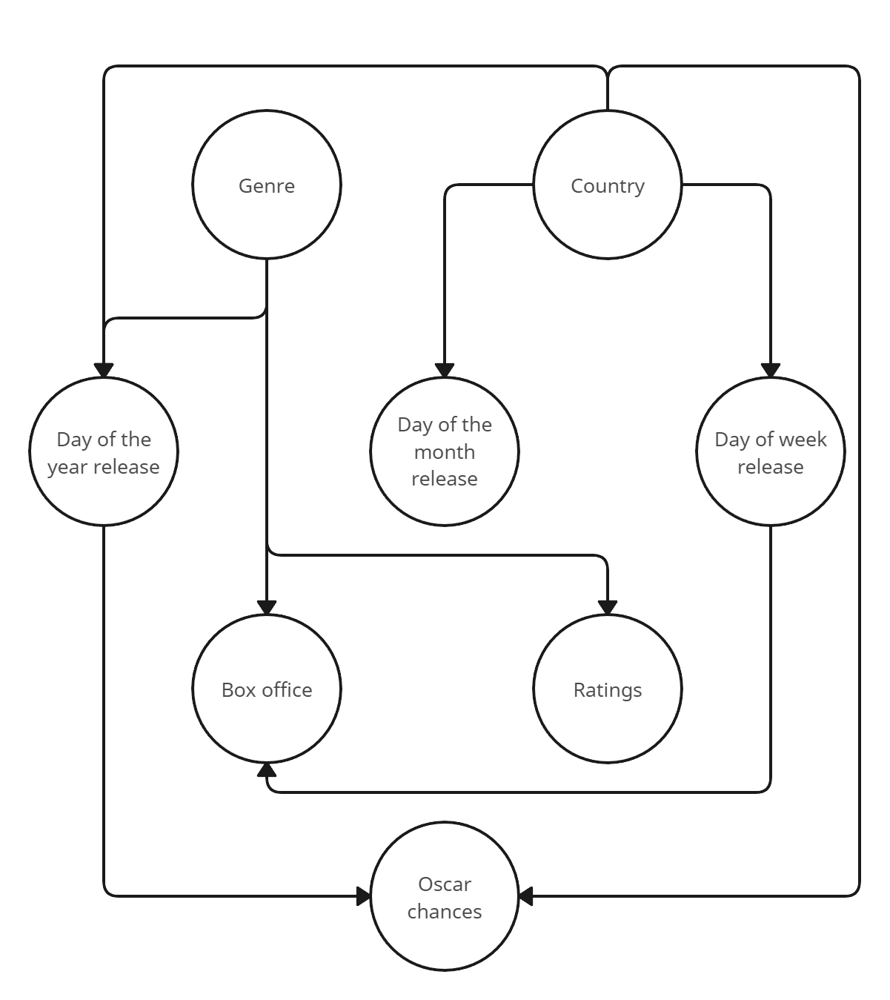

## Introduction

All things on earth exist under the cold, cruel hands of father Time, and the movie industry is no exception. It’d be easy to think that we, as intelligent beings,
are above the concept of temporal bias, that the weather has no influence on our perception of movies and that in the Oscar season, the movie we vouch for is
obviously our favorite, and not just the freshest in our memory. In actuality, our perception of a movie, just as our perception of a meal, can be very contextual,
and what better context than time itself. We think that there are some correlations between a movie’s success and its release date within different time-frames and
that the producers know it, and exploit it. Our goal is to show how us simple creatures are influenced by time in our perception of movies, and what are the
strategies movie studios use to benefit from this bias, whether it's expressed within a month, a year, a decade or a lifetime. To this end, we need to ask ourselves
a couple of questions.

---

## When are movies released ?

Now we are going to figure out when movies are currently being released in different timeframes and try to highlight particular trends of interest. Here is then a world map showing the mean movie release rate of each country between 1950 and 2011 across the week, month and year. This ‘release rate’ variable was computed by looking at what percentage of a country’s yearly releases is released each time point and standardizing this data within each country between 0 and 1. Keep in mind these values are entirely relative to each country, you can see the actual number of movies released by hovering over the country.

<select id="chartType">
 <option value="week">Week</option>
 <option value="day">Day</option>
 <option value="weekday">Weekday</option>
</select>

<iframe class="toggle-frame" src="assets/plot/movie_world_map_weeks.html" width="750px" height="530px" frameborder="0" position="relative"  id="week" style="display: block;"></iframe>
<iframe class="toggle-frame" src="assets/plot/movie_world_map_day.html" width="750px" height="530px" frameborder="0" position="relative"  id="day" style="display: none;"></iframe>
<iframe class="toggle-frame" src="assets/plot/movie_world_map_weekday.html" width="750px" height="530px" frameborder="0" position="relative"  id="weekday" style="display: none;"></iframe>

Let’s first take a look at weekdays. Each of us coming from different countries, we were surprised that the usual movie release weekday in our country is not an international standard, this is very clearly illustrated on the map. As we can see, most of the world releases their movies on Fridays and Thursdays. These choices are pretty easy to understand; end of the work week outings make people more susceptible to go to the movies. Studios can then capitalize on a full opening weekend, which is a critical metric of a movie’s success. However, there are still some oddballs in the mix. For example, Japan seems to prefer Saturdays to release movies, which considering the importance of the opening weekend doesn’t seem to be the best choice. Similarly, France and the Philippines opt for Wednesdays, a decision that may initially appear unconventional. An important thing to consider is that local strategies of movie releases during the week are heavily dependent on local culture and habits. Unlike many Western countries where school days conclude around 3 pm consistently, French students often finish between 4 and 6 pm on weekdays, with Wednesdays ending at noon. The midweek break gives students their whole Wednesday afternoon off, making it a favorable choice for movie releases compared to Friday.

Regarding release dates within a month, it is truly shocking to see how many more movies come out the first day of the month compared to the rest, so shocking that it becomes suspicious. After some analysis, it becomes clear that this is due to faulty data. Our theory is that when inputting the release date of a movie, if the only data available is the month of release, people will sometime put the first day of that month as a default. The only actual relevant thing that seems to stand out are mid-month releases in Asia, but aside from that, since vacations and availability of the public can change from one month to another, there shouldn’t be any particular strategy that can be highlighted regarding months as a whole.

Now let's look at releases within a year. One immediate trend that is noticeable is that a lot of country’s maximum rate of release seem to take place around the 35th week of the year, which corresponds to the end of August and beginning of September. There also seems to be a smaller peak in the 20th week, which corresponds to mid-May. Before jumping to any conclusion, we’d like to see if there’s an actual statistical relevance to these observations. To this end, we performed a PCA analysis of movie releases across the years and plotted the projected movie releases using four principal components. This process highlights mutual variations between each year, so in this graph each plot corresponds to a plot between 1950 and 2011.

As we can see, this analysis validates our initial observation. There is an initial surprise to these results because it is common knowledge that the highest grossing movies are released during the summer, the intuition would be that if a movie wants a high gross it should be released during this blockbuster season. Why then are the weeks with the highest release rates before and after the summer season ? Our explanation is that blockbuster movies released during the summer are the highest grossing but also have the biggest budget. Releasing a movie during this period would mean being pit against some of the biggest studios in the world for publicity and theater space. Most studios don’t have this kind of budget, but our theory is that releasing a movie right before or after this period gives the chance of partly benefiting from the increased audience attendance caused by vacations and good weather, while not having to go against Warner Bros to have your movie released in theaters.

## Best Release date analysis

In this part, we're trying to figure out the ideal release date for movies that guarantee the best performance at the box office. Our analysis covers data spanning from 1897 to 2012 across 87 countries.

### Monthly Correlation Analysis

Our main method is regression analysis, examining if there's a connection between the 'release month' and the 'box office' performance. The formula we use for monthly analysis is:


<html lang="en">
<head>
 <meta charset="UTF-8">
 <meta name="viewport" content="width=device-width, initial-scale=1.0">
 
 <title>MathJax Example</title>
</head>
<body>

\[ Y = \beta_0 + \beta_1 x_1 + \beta_2 x_2 + \ldots + \beta_{11} x_{11} \]

</body>
</html>


Y = Box office \
X = Dummies variable of release month (Note: here we use December as a benchmark)



The confidence interval couldn't be visualized on that graph, see section 4.3 from the Jupyter Notebook to see them on a non-interactive graph.

#### Introduction of the plot
Note the value of the bars is the coefficient value of <math><mi>&#x03B2;</mi>0<mo>,</mo><mi>&#x03B2;</mi>1<mo>,</mo><mi>&#x03B2;</mi>2<mo>,</mo><mo>&#x2026;</mo><mi>&#x03B2;</mi>11</math>\
When we move the animation frame, we will do the regression using the data from 1914 to the year of the animation button.

#### Identifying the Best Month
In this part, we only analyze the correlation between the box office and release month. Next section will conduct a causal analysis. After conducting regression for all 87 countries from 1897 to 2012, we can see that June consistently yields a higher average Box Office compared to other months. Our initial assumption is that June is generally the best release month for generating higher box office returns.

Has June consistently been the optimal release month across history? The answer is 'no'. By conducting regression analysis across 87 countries from 1914 to 1938, we observe that December emerges as the most successful release month during this period. As we extend the time interval to 1980, the coefficient for June gradually increases, eventually surpassing that of December. However, it is worth noting that December-released movies maintained dominance as the highest box office movies in the year for a long time.
Further extending the analysis beyond 1980 reveals that the coefficients for May and July generally surpass those of December. Nevertheless, it remains evident that movies released in December consistently achieve higher box office success compared to those released in most other months.

### Weekly Correlation Analysis

Similar to the regression of month, we regress the box office on the dummies variable of weeks day.


<html lang="en">
<head>
 <meta charset="UTF-8">
 <meta name="viewport" content="width=device-width, initial-scale=1.0">
 
 <title>MathJax Example</title>
</head>
<body>

\[ Y = \beta_0 + \beta_1 x_1 + \beta_2 x_2 + \ldots + \beta_{52} x_{52} \]

</body>
</html>


Y = Box office \
X = Dummies variable of release week (Note: here we use week 53 as a benchmark)



#### Introduction of the plot
Note the value of the bars is the coefficient value of <math><mi>&#x03B2;</mi>0<mo>,</mo><mi>&#x03B2;</mi>1<mo>,</mo><mi>&#x03B2;</mi>2<mo>,</mo><mo>&#x2026;</mo><mi>&#x03B2;</mi>52</math>\
When we move the animation frame, we will do the regression using the data from 1914 to the year of the animation button.



#### Identifying the Best Week
In our investigation into weekly trends, we designate week 53 as our benchmark and conduct regression analysis using dummy variables for weeks across 87 countries from 1897 to 2012. The exciting thing is that weeks 20, 21, and 23-30 consistently exhibit higher box office figures than other weeks, indicating an upward trend on average. Notably, weeks 23-26 align with June, and weeks 27-31 correspond to July.
Weeks 46, 47, and 50 also perform well, coinciding with November and December midpoints, respectively.
Our regression analysis, focusing on the relationship between box office performance and weeks, reinforces our initial assumption and reflects the trends observed in our monthly analysis. It reaffirms that summer is the premier release period for maximizing box office earnings, while winter is the second-best option.

## Box office Causal analysis

Now, with the idea that releasing movies on summer and winter vacation might raise higher box office revenue, it is good to go deeper and find some causal links. In this section, we will split the data by country and research them separately. For a specific country, we will research the regression on a specific month.

### Methodology
We will make an example to clarify the method we use. Suppose we research the data for the US in January. Firstly, we will get the data only for the US and split it into two groups. One is in January (control group), and the treatment group is for all other months except January. Then, we match the control and treatment groups on all relevant covariates, to have them be the same size. Finally, we will do the regression below. Note that most countries will not have enough movies in our dataset to conduct this matching and get some statistically significant results. Despite this, those countries are still interesting to visualize.


<html lang="en">
<head>
 <meta charset="UTF-8">
 <meta name="viewport" content="width=device-width, initial-scale=1.0">
 
 <title>MathJax Example</title>
</head>
<body>

\[ Y = \beta_0 + \beta_1 x \]

</body>
</html>


Y = Box office \
x = indicator variable for whether the data corresponds to the month we are researching.

| Relevant Covariate        | Description                                      |
|------------------|--------------------------------------------------|
| Movie budget     | The financial resources allocated to a movie      |
| Release year     | The year when the movie was released              |
| Genre            | The genre of the movie                 |

For a given month, each country will have a control group and a treatment group that will be similar on the distribution of every variable, except for whether the movies were released that particular month. For the countries that didn't produce enough movies to perform that statistical analysis, we simply define the effect size (value of coefficient \beta_1) as the variation of the mean between the two groups, and the P-value as 1 (i.e. not statistically significant).

### Monthly Causal Analysis
Due to limited data availability, our analysis primarily focuses on six countries with substantial datasets—namely, the US, UK, Germany, France, Canada, and Korea—each boasting over 200 data points. By setting the P-value threshold as 0.05, we aim to figure out significant patterns and insights. The visual representation below reveals that only a few data points exhibit significant effect_sizes (beta_1) across countries and months, offering valuable insights. On the graph below, the average box office is the average box office for movies released in that month and country (i.e. it's not the intercept, but the intercept + the effect size).



In June, both the US and Germany showcased significant positive effect sizes, supporting our initial hypothesis that June is an optimal release month. However, the landscape shifts in July, where only France registers significant effect sizes, interestingly turning towards the negative. This violates our original assumption. It could come from the fact that people in France often travel and enjoy holidays in July, but a deeper analysis would be required to confirm this hypothesis.
During January, February, and October, the US stands out with significant negative effect sizes, challenging the assumption that releasing a movie at the end of summer or winter is good. It differs from the implications in the "Correlation Analysis" regression graph, which suggested positive outcomes for summer and winter releases. These observed correlations probably come from US movies having a higher budget in those periods.
What makes things complex is that the UK presented significant effect sizes in April. Notably, Canada and Korea seem to not factor significantly into this particular analysis.

This analysis shows that the dataset has a lot more American movies than movies from other countries. It forces us to mainly analyze these effects on American movies. Our main result is that we have a very high confidence that in the US, releasing a movie in June will statistically increase its box office.

### Genre Causal Analysis

In this section, we'll explore how different movie genres are affected by monthly releases. Regarding Drama, it's not ideal to launch a movie in January, September, and October. Indie films, on the other hand, thrive when released in May and September, but the opposite holds for October. Comedy movies perform well with a June release but suffer at the box office if launched in August. As for Romance films, June is an ideal release month, but it's not recommended for September and October. Yet, disregarding the statistical significance, it becomes evident that all data points exhibit positive effect_sizes for June and July. Remarkably, Drama has the most movie release amount in all the months, indicating the analysis for Drama is more likely to be representative of reality.



### Weekdays Causal Analysis
Ignoring the importance, we notice that effect sizes are positive on Monday, Tuesday, and Wednesday but negative on Friday and Saturday for most countries. Unfortunately, only four bubbles stand out as significant at a 95% confidence level. Among them, three are from the US, indicating that releasing on Monday and Wednesday would be beneficial, while Friday releases might hurt the box office. The fourth significant bubble suggests that releasing on Wednesday in the UK could boost the box office on average. It's worth noting that two significant bubbles align with the initial observation that Wednesday could be a favorable release day.



From the picture below, we can see our data mainly come from the US, the UK, France, India and Japan. And they prefer to release the movie around weeks 20 and 36. But from our "Rough Analysis", it would not have a comparative high box office on average around weeks 20 and 36.



In conclusion, releasing a movie on Wednesday or June would be better for the box office than on other weekdays and months in the US. In addition, we have lots of evidence indicating that Wednesday and June are the best weekdays and months for most countries from the three comprehensive analyses above.

## Oscar Causal Analysis

The choices of release date made by studios are not always based on making money. Sometimes, they are based on prestige, so that they can make a lot of money at a later date. In the movie industry, this prestige is materialized by the ultimate recognition : an Oscar. It is known that the submission deadline to win an Oscar is usually around the end of the year. Furthermore, it is said that the Oscar season, ranging from October to December, is the season where moviemakers release their movies that are the most likely to win an Oscar. In this chapter, we will try to investigate the effect of Oscar season.

First and foremost, we will look at the distribution of Oscar over the years.



As we can see on the above figure, there seem to be a clear trend of more Oscar being won by movies coming out at the end of the year. The trend seems rather consistent over the years, which can be explained by the fact that almost all Oscar ceremonies took place between February and April. It would be simple to say that if a moviemaker wants to win an Oscar, they would have to release it between October and December. Having observed this supposed effect, the next natural question is : do movies have a better chance of winning an Oscar when they are released at the end of the year, simply because that's when the best movies are released ?

As we will see from our data, the answer is probably not. At least, we can say that they are not quality perceived by the public that make these movies better than movies released the rest of the year.

To begin our analysis, we start by comparing the effect of releases in all four quarters of the year on the amount of Oscar won. For each period, we need to make a propensity score matching based on relevant covariates. The table below summarizes those covariates.

| Relevant Covariate        | Description                                      |
|------------------|--------------------------------------------------|
| Movie budget     | The financial resources allocated to a movie      |
| Release year     | The year when the movie was released              |
| Genre            | The genre of the movie                 |
| Countries        | The countries where the movie was released    |

After doing the matching on those covariates, we will verify that the following covariates are well distributed with a simple standardized mean difference test. We decided not to match on the rating, because it is not a cause of the movie's success, but a consequence of it. However, checking the distribution of the ratings is a good indicator of the movie's public perception. Indeed, it is possible that movies released during the Oscar season have the same budget as movies released during other seasons, but with a different kind of storytelling quality. We think that the ratings could be a variable that indicates the work put on the script, as terminally online movie critics are usually more deeply involved and will be more critical of bad stories.

| Covariate To Check       | Description                                      |
|------------------|--------------------------------------------------|
| Rating    | The average rating of each movie      |
| Movie budget    | The year when the movie was released              |

We report that for each of the following matching, the two covariate on the table above passed the standardized mean difference test. This is an indication that the quality and budget of movies is consistent all year round. Because of that, we can affirm that every result we found on the impact of the season on the number of Oscars won is probably a real effect of the season.

The figure below shows the different periods of movie releases. To add to that, all clusters have statistics about the effect of that cluster's period on the number of Oscars won.



As we see on the figure above, none of the season's effects on the number of Oscars won are statistically significant. However, looking at the data, there seems to be an effect anyway. In addition to that, the last season has a p-value of 0.06, which is too big to be statistically significant, but is a solid clue that there is more at play here.

To deepen the analysis, we will try to find better seasons than just the four quarters of the year. For that, we use the K-means algorithm with K=4. Since the goal is to get clear separation dates for our data, we will simply cluster the movies that won an Oscar based on their release date. Such a clustering gives us slightly different seasons, but a high impact on the results.



As a reminder, the movies released in all clusters have a balanced distribution of rating as well as budget. The figure above shows that the beginning of the year is a bad time to release a movie if the goal is to get some Oscars. With an intercept of 0.17 and an effect size of -0.06, the impact is far from negligible. However, the more surprising result is the end of the year, which shows an effect size of 0.13 on an intercept of 0.17. This means that the average number of Oscars won during that period is almost twice as much as during the rest of the year, with variables like budget, country, genre and release year controlled.

To conclude this analysis, we note that our K-means algorithm has considered dates like 31 of December to be far away from 01 January, even though it is just one day apart. It is possible that a good clustering ends on the last day of December because the industry is based on human activities. However, to make sure that this is the case, we need a clustering that doesn't have to consider December and January as far apart. For that, we transform the days of the year, as illustrated in the following animation.



With this new paradigm, we can reconsider a K-means clustering based on the coordinates of the days of the year on a unit circle. When applying the same algorithm used for the other clusters, this is what we get.



The effect size of the last cluster is much smaller than it was on the previous analysis. Indeed, we have an effect size of 0.08 on an intercept of 0.17. This means that adding those January days to the cluster only diminishes the effect. Therefore, there is a strong disconnect between December and January for the prospect of winning Oscars. We also note that the effect of the first cluster is very close to the first cluster in the previous analysis. In conclusion, it seems like Oscar season is the real deal, and moviemakers who want to win an Oscar have a strong incentive to release their movies towards the end of the year.

But is it true for every genre ? To figure it out, we analyze each genre separately. To interpret the figure below, we note that most movies have multiple genres, so most of them will appear in more than one category. Despite this, the figure is still useful to notice some patterns that we will analyze further.



As we can see, dramas seem to contain most of the effects observed in the previous figures. The effect size of releasing a drama movie at the end of the year as well as at the beginning of the year is enormous.

To finish this chapter, we look at the same figure with movies that are not dramas. Surprisingly, there is no effect of releasing on the last cluster. The only cluster that has an impact is the second one, with a negative correlation.



In conclusion, if it's October to December, to nab an Oscar, stage a drama ! If it's the beginning of the year, release nADA !

## Conclusion

 

With our story coming to an end, it wouldn’t be applied data analysis without some causal diagrams, so let’s now explore what relations we can draw from our study between the different variables that go into releasing a movie. At the highest level, the Genre and Country of origin of a movie are intrinsic characteristics.
The Country of origin will mainly have a causal influence on the release date of the movie, whether it’s within a week, a month or a year. These influences are generally mediated by local culture and habits; different work weeks, vacations and seasons will have a direct impact on the release date of a movie. The Country variable also has a direct influence on the Oscar chances, but this is due to the Oscars being an American ceremony. In a nutshell, if the movie is not English, it has fewer chances of winning an Oscar.

Regarding the genre, we were only able to see a small influence on the release date within a year, for example, horror movies will more consistently come out around October from year to year. However, genre does have a big impact on box office and ratings, however this influence was expected since the cinematic quality and public hype of a movie are closely tied to its Genre. For example, while a big superhero action movie will most surely kill it at the box office (this becomes less and less true with each passing day) it won’t necessarily be critically acclaimed and vice versa for an indie 3 hour long drama cinematic masterpiece.
Now, regarding release dates. Unsurprisingly, the release date within a month has no effects. Months are not really a repeating equal timeframe like a week or a year, so it makes sense that there wouldn’t be any particular day that’s common to every month. However, we see that the weekday of release does have an influence on the box office. That is because the opening week and weekend of a movie are critical in its overall success. A poor opening week will lead theaters and promoters to drop the movie, making it even less likely to do well in the long run. And finally, the release date within a year has a clear impact not only on the box office thanks to periods like the blockbuster season, but surprisingly, as we saw in our in-depth Oscar analysis, it also impacts the movie’s chances of winning an Oscar. Typically, the latter in the year a movie is released, the higher the chances of it being considered for an Oscar.

And so finally, here we are, the million-dollar question: when should you release a movie ? It depends. Many of our initial assumptions about the influence of time are either marginal or dependent on various different factors, so there isn’t a clear and concise way to know when is the best time to release a movie. However, there are still some factors which can help you out if money and fame are within your goals:
If you want better chances to win an Oscar, your movie should come out in the last quarter of the year and should be a drama.
The blockbuster season is real folks and will very much give you an advantage in the box office.
Weekday choice should depend on the specifics of each country, however, we know that movies coming out on Monday and Wednesday tend to fare better at the box office.

## Ethical considerations

It has rarely been more evident that the movie industry doesn’t shine through its ethical labor practices. For the past year, exhausted and underpaid writers and actors striked to make their voices heard and rights respected. One common grip workers in the industry have with studios is the tight schedule that is forced on the artistic process of movie making. Poor writing, rushed dialogues, unfinished special effects; artists at every level of the process are squeezed by the industry’s infamous time crunches. To get the movie out, whatever its state, for the blockbuster season, the Christmas season, studios make it seem the whole world is going to end if people aren’t able to see the newest Transformers in theaters this summer. We’ve gone through a thorough analysis to determine when is the best time to release a movie, but in reality, the best time is always when the movie is done. Trying to pinpoint the precise dates that give studios a marginal increase in profit is the exact kind of greedy attitude that the Screen Actors Guild and the Writers Guild of America are trying to denounce. It puts profit before artistic quality and integrity. However, it seems more and more that audiences are tired of paying often more than ten bucks to watch a messy rush-job in theaters. So maybe, for the benefit of audiences, workers and cinema as a whole, it’s best to leave this kind of knowledge out of the studios’ hands.

